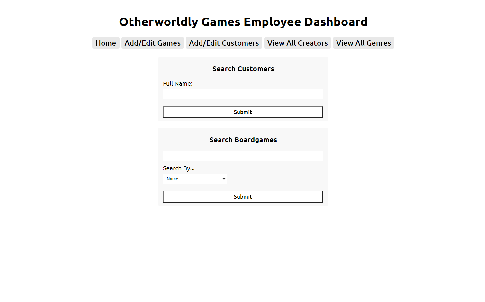
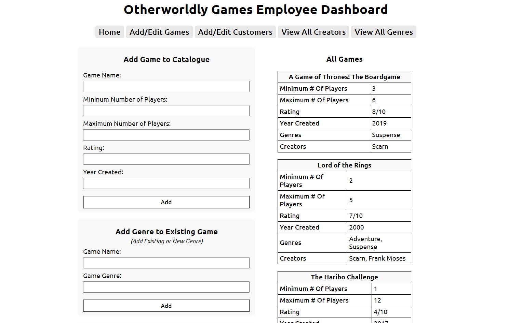
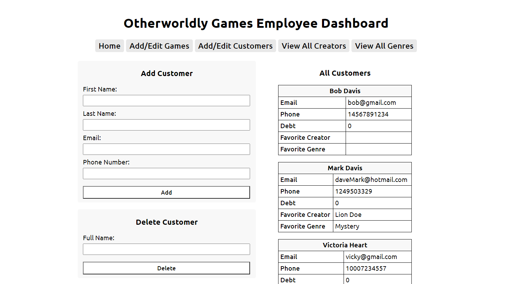

# Otherworldly Games

Otherworldly Games is a board game library on an alien planet. Aliens across the galaxy come here to fulfill their quest for fun board games with their intergalactic buddies. This database represents the information the library needs in order to run its business, including checking out games as well as keeping track of the creators of the games, the genres, and details about the games in order to obtain the right game for their needs. It is also necessary to keep track of the rentals of the games to make sure that a game is not rented when it is unavailable. Customers can rent as many board games as they would like, but there is only one copy of each. Otherworldly Games has 100 games available to borrow for their 150 customers. Their 15 employees and 2 owners access the information daily in order to facilitate rentals - rentals are only done in person.

This website and database project was created by Nancy Nguyen and Katelyn Lindsey.

## Screenshots of the Final Website
### Home Page

### Add/Edit Games Page

### Add/Edit Customers Page

